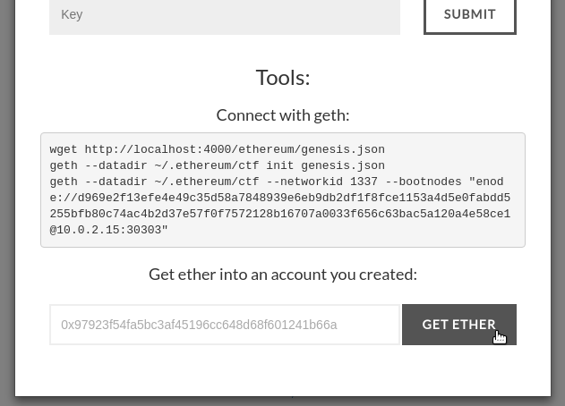
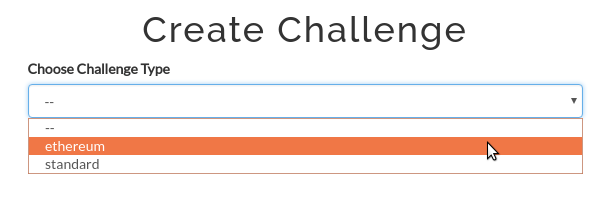
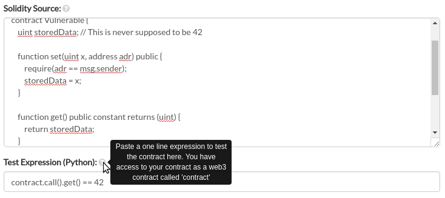
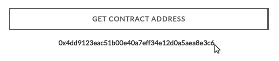
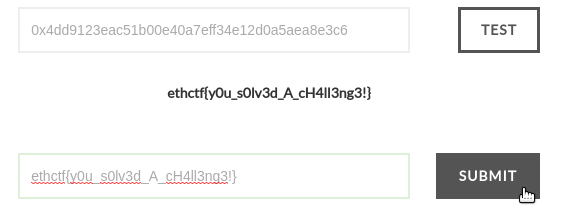

# ethereum-ctf
Ethereum-ctf is a framework for capture the flag competitions on the ethereum blockchain. It is a CTFd plugin (https://github.com/CTFd/CTFd). It runs a proof of authority blockchain and connects runs a http web3 provider. It deploys and tests Ethereum smart contracts.

## Usage
Just paste the solidity source and the test condition into the boxes provided when creating a contract of type "ethereum." The source must contain a contract called "Vulnerable."

The plugin creates a new challenge type: "ethereum"

When creating a challenge, paste in the solidity source and write a python expression that evaluates to true on a successful solve.

To solve the challenge, the address to a new contract must be requested:

The user can connect to a running blockchain using the displayed commands and can use the faucet to acquire some ethereum to exploit the vulnerable contracts.

After solving the challenge, a flag can be requested.

## Requirements
 - `pip install -r requirements.txt`
 - CTFd
 - geth
 - puppeth
 - ports 30301 (UDP) & 30303 (TCP & UDP) open

## Installation
Clone it into the `CTFd/plugins/` directory.
